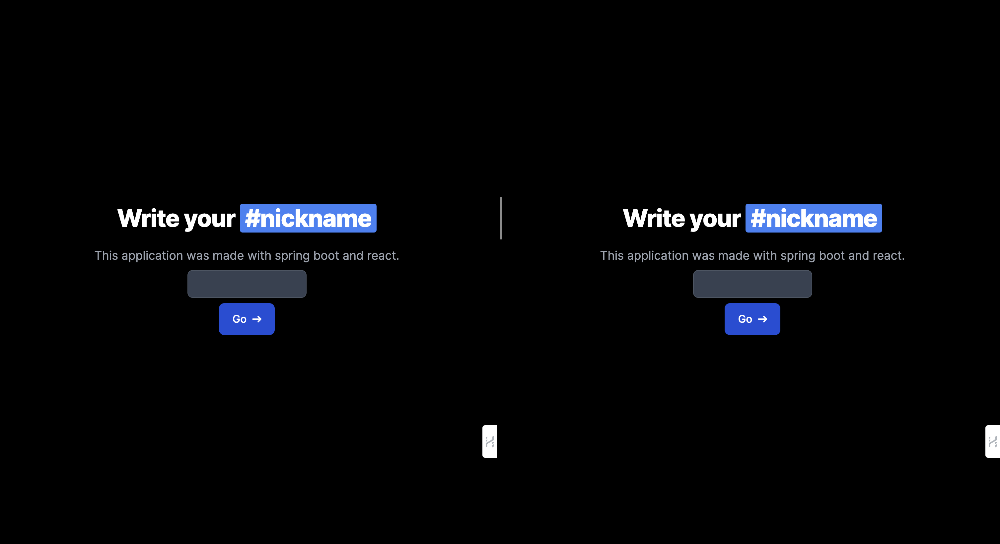

# Realtime Chat Application using Spring Boot and React

---

##### Introduction

This project is a realtime chat application developed using Spring Boot and WebSocket. The application allows users to join, chat, and leave chat rooms in real-time. Spring Boot provides a robust and scalable architecture for the application, while WebSocket enables real-time communication between the server and clients. The application has features such as joining chat rooms, sending messages, and leaving chat rooms, providing a seamless and interactive chatting experience for its users.

#####3 Introduction(Watch Youtube)

   <a href="https://youtu.be/lHQQVwERzSo">
      
      </a>

---

##### Websocket

WebSocket is a computer communications protocol, providing full-duplex communication channels over a single TCP connection. WebSocket is distinct from HTTP.

The protocol enables interaction between a web browser (or other client application) and a web server with lower overhead than half-duplex alternatives such as HTTP polling, facilitating real-time data transfer from and to the server.

Once a websocket connection is established between a client and a server, both can exchange information until the connection is closed by any of the parties.

This is the main reason why WebSocket is preferred over the HTTP protocol when building a chat-like communication service that operates at high frequencies with low latency.

---

##### Stomp JS

Simple (or Streaming) Text Oriented Message Protocol (STOMP), formerly known as TTMP, is a simple text-based protocol, designed for working with message-oriented middleware (MOM). It provides an interoperable wire format that allows STOMP clients to talk with any message broker supporting the protocol.

Since websocket is just a communication protocol, it doesn't know how to send a message to a particular user. STOMP is basically a messaging protocol which is useful for these functionalities.

---

##### Sock JS

SockJS is used to enable fallback options for browsers that don't support WebSocket. The goal of SockJS is to let applications use a WebSocket API but fall back to non-WebSocket alternatives when necessary at runtime, i.e. without the need to change application code.

Under the hood, SockJS tries to use native WebSockets first. If that fails, it can use a variety of browser-specific transport protocols and presents them through WebSocket-like abstractions.

---

##### Codes

---

##### Backend

##### Websocket configuration

This Java code configures WebSocket using the Spring Framework. WebSocket is commonly used in real-time applications to enable bi-directional communication between client and server. The code implements the `WebSocketMessageBrokerConfigurer` interface to enable and customize the WebSocket message broker. Let's go through the code in detail:

Path: config>WebSocketConfig.java

```java
@Configuration
@EnableWebSocketMessageBroker
public class WebSocketConfig implements WebSocketMessageBrokerConfigurer {}

```

- `@Configuration`: Indicates that this class is a configuration class. Spring will load this class when the application context is started and apply the configuration settings.
- `@EnableWebSocketMessageBroker`: This annotation enables the WebSocket message broker, allowing the application to support WebSocket messaging.
- The WebSocketConfig class implements the `WebSocketMessageBrokerConfigurer` interface, which allows for customization of the WebSocket messaging configuration.

```java
    @Override
    public void configureMessageBroker(MessageBrokerRegistry registry) {
        registry.enableSimpleBroker("/user");
        registry.setApplicationDestinationPrefixes("/app");
        registry.setUserDestinationPrefix("/user");
    }

```

- The configureMessageBroker method configures the message broker.
  - `registry.enableSimpleBroker("/user")`: Enables a simple in-memory message broker and sets /user as the prefix for destinations that the broker will handle.
  - `registry.setApplicationDestinationPrefixes("/app")`: Specifies that messages sent from clients with destinations prefixed with /app should be routed to message-handling methods in the application.
  - `registry.setUserDestinationPrefix("/user"):` Sets the prefix used for user-specific messages. This is useful for private messaging.

```java
   @Override
    public void registerStompEndpoints(StompEndpointRegistry registry) {
        registry.addEndpoint("/ws")
                .setAllowedOrigins("http://localhost:3000")
                .withSockJS();
    }
```

- The registerStompEndpoints method registers STOMP (Simple Text Oriented Messaging Protocol) endpoints.
  - `registry.addEndpoint("/ws"):` Adds an endpoint at /ws for clients to establish WebSocket connections.
  - `.setAllowedOrigins("http://localhost:3000")`: Specifies that connections to this endpoint are allowed from the origin http://localhost:3000.
  - `.withSockJS():` Enables SockJS support, which provides fallback options for browsers that do not support WebSocket.

```java
     @Override
    public boolean configureMessageConverters(List<MessageConverter> messageConverters) {
        DefaultContentTypeResolver resolver = new DefaultContentTypeResolver();
        resolver.setDefaultMimeType(MimeTypeUtils.APPLICATION_JSON);
        MappingJackson2MessageConverter converter = new MappingJackson2MessageConverter();
        converter.setObjectMapper(new ObjectMapper());
        converter.setContentTypeResolver(resolver);
        messageConverters.add(converter);
        return false;
    }
```

- The configureMessageConverters method configures the message converters.
  - `DefaultContentTypeResolver resolver = new DefaultContentTypeResolver()`: Creates a default content type resolver.
  - `resolver.setDefaultMimeType(MimeTypeUtils.APPLICATION_JSON)`: Sets the default MIME type to JSON.
  - `MappingJackson2MessageConverter converter = new MappingJackson2MessageConverter()`: Creates a message converter for JSON messages.
  - `converter.setObjectMapper(new ObjectMapper())`: Configures the converter to use a Jackson ObjectMapper for JSON serialization and deserialization.
  - `converter.setContentTypeResolver(resolver)`: Sets the content type resolver for the converter.
  - `messageConverters.add(converter)`: Adds this converter to the list of message converters.
  - `return false`: Indicates that the default message converters should not be overridden. If this returned true, only the custom converters added would be used.\*

##### Dependencies

This code relies on the following Spring Framework imports:

- `org.springframework.context.annotation.Configuration`: Indicates that this class is a configuration class.
- `org.springframework.messaging.simp.config.MessageBrokerRegistry`: Allows configuration of the message broker for WebSocket communication.
- `org.springframework.web.socket.config.annotation.*`: Provides annotations and interfaces for configuring WebSocket endpoints.

---

### Frontend

This React code snippet demonstrates how to set up a WebSocket connection using the SockJS and STOMP (Simple Text Oriented Messaging Protocol) libraries, and how to handle real-time messaging. It uses the useEffect hook to establish the connection and subscribe to a specific message queue. Here's a detailed breakdown of what each part of the code does:

#### useEffect Hook

The useEffect hook is used to set up and clean up the WebSocket connection. It runs when the testMessage dependency changes.

```js
useEffect(() => {
  const socket = new SockJS("http://localhost:8080/ws");
  const stompClient = new Client({
    webSocketFactory: () => socket,
    debug: (str) => console.log(str),
    onConnect: () => {
      console.log("Connected");
      stompClient.subscribe(
        `/user/${testMessage.id}/queue/messages`,
        (message) => {
          const newMessage = JSON.parse(message.body);
          setMessages({
            id: newMessage.id,
            content: newMessage.content,
            recipientId: newMessage.recipientId,
            senderId: newMessage.senderId,
          });
        }
      );
    },
    onDisconnect: () => {
      console.log("Disconnected");
    },
  });

  stompClient.activate();
  setClient(stompClient);

  return () => {
    stompClient.deactivate();
  };
}, [testMessage]);
```

#### Socket Initialization:

- `const socket = new SockJS('http://localhost:8080/ws')`;

  - This creates a new SockJS connection to the specified URL (`http://localhost:8080/ws`).

#### `STOMP Client Configuration`:

- const stompClient = new Client({ ... });
  - This initializes a new STOMP client with several options:
  - webSocketFactory: Uses the SockJS connection.
  - debug: Logs debug messages to the console.
  - onConnect: Callback function that runs when the connection is established. \* onDisconnect: Callback function that runs when the connection is disconnected.

#### Subscription to Messages:

- `stompClient.subscribe(/user/${testMessage.id}/queue/messages, (message) => { ... })`;
  - Subscribes to a specific message queue (`/user/${testMessage.id}/queue/messages`). When a message is received, it parses the message and updates the state (`setMessages`) with the new message details.

#### Activation and Deactivation:

- `stompClient.activate()`;
  - Activates the STOMP client, establishing the connection.
- `return () => { stompClient.deactivate(); };`

  - Cleans up by deactivating the STOMP client when the component unmounts or when `testMessage` changes.

#### `sendMessage` Function

The `sendMessage` function is used to send a message to the server.

```js
const sendMessage = () => {
  if (client && input) {
    client.publish({
      destination: "/app/chat",
      body: JSON.stringify({
        senderId: testMessage.senderId,
        recipientId: testMessage.recipientId,
        content: input,
        timestamp: Date.now(),
      }),
    });
    setInput("");
  }
};
```

- Checks for Client and Input:

  - `if (client && input)`
    - Ensures that there is an active STOMP client and input is not empty.

- Publishing a Message:

  - `client.publish({ destination: '/app/chat', body: JSON.stringify({ ... }) })`;
    - Sends a message to the server with the specified destination (`/app/chat`) and the message body in JSON format. The message includes `senderId`, `recipientId`, content, and a timestamp.

- Resetting the Input:

  - `setInput('')`;
    - Clears the input field after the message is sent.

#### Summary

- **WebSocket Connection**: The useEffect hook sets up a WebSocket connection to the server using SockJS and STOMP.
- **Subscription**: Subscribes to a specific message queue to receive messages.
- **Message Handling**: Parses received messages and updates the state.
- **Cleanup**: Deactivates the STOMP client when the component unmounts or when testMessage changes.
- **Sending Messages**: The sendMessage function allows sending messages to the server.

This setup is useful for real-time applications where live updates and instant messaging are required.

---


# :e-mail: Contact
|***Sefa Demirtaş***|
|:-------------|
|*Software Developer*|
|[Linkedin](https://www.linkedin.com/in/sefa-demirtas)|
|sefa.demirtas91@gmail.com|

